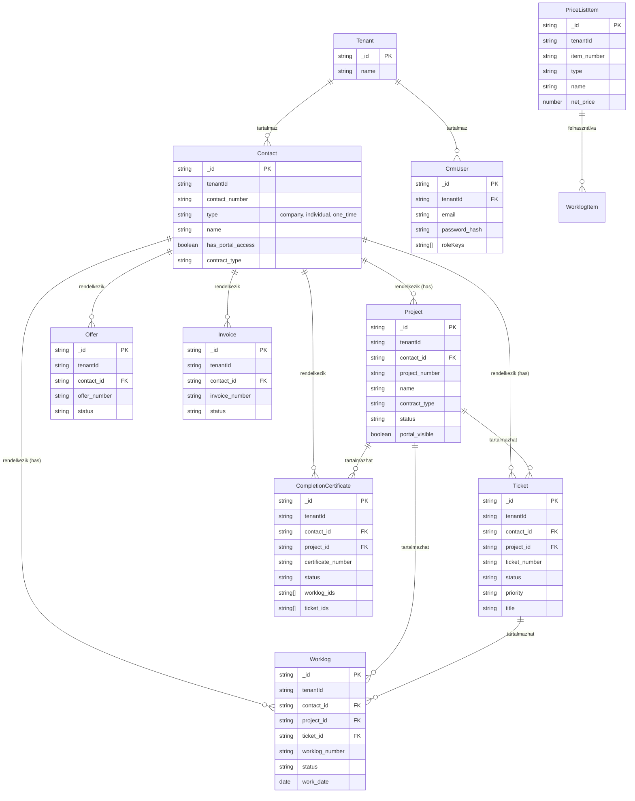

# SIRONIC IntraSystem Adatbázis Struktúra

A projekt jelenleg a `packages/types/src/index.ts` fájlban definiálja az alapvető üzleti modelleket. Ezek a TS típusok/interfészek adják majd a MongoDB (Mongoose) sémák alapját, ahogy a rendszer további része megépül.

Tervezett architektúra főbb jellemzői:

- **Több-bérlős (Multi-tenant):** Minden entitás rendelkezik egy `tenantId` mezővel a különböző adatigényű felhasználók/környezetek izolálására.
- **Relációs hálók:** Globális azonosítókkal (`_id`, ID string) hivatkoznak egymásra a rekordok (pl. `contact_id`, `project_id`, `ticket_id`, `price_list_item_id`).

## Entitás Kapcsolati Diagram (ERD)

## Fő Entitások Részletes Leírása

### 1. Contact (Cég / Magánszemély)

Az ügyfeleket tároló kollekció (lehet teljes szerződött partner, vagy eseti \`one_time\` érdeklődő). Korábban `Organization`-ként is funkcionált.

- **Típusok:** `company` (cég), `individual` (magánszemély), `one_time` (egyszeri/alkalmi).
- **Legfontosabb mezők:**
  - `address`, `billing_address`: Pontos címadatok, számlázási információk.
  - `contact_persons`: Kapcsolattartó személyek listája (név, beosztás, telefon, email).
  - `portal_permissions`: Partner portál menüpontok hozzáférései.
  - `contract_type`, `active_services`: A szerződés jellege és aktív szolgáltatások gyűjtője.

### 2. Project (Projekt)

Egy adott ügyfélhez kapcsolódó, hosszabb távú együttműködés, fejlesztés, vagy dedikált megbízás.

- **Legfontosabb mezők:**
  - `contact_id`: Ügyfél kapcsolódás.
  - `phases`: Részfázisok (ProjectPhase) listája határidőkkel és készültséggel.
  - `checklist`: Tennivalók (ChecklistItem), fájlfeltöltési kötelezettség is kérhető benne.
  - `staging_links`: Kliens által jóváhagyandó linkek (pl. tesztkörnyezetek, demó weboldalak).
  - `budget_hours`: Tervezett vagy kiosztott "vödörnyi" munkaórakeret.

### 3. Ticket (Hibajegy / Feladat / Jegy)

Üzleti feladat, ügyfélszolgálati megkeresés, vagy akár belső support igény.

- **Legfontosabb mezők:**
  - Konkrét entitásokra hivatkozás: `contact_id`, valamint opcionálisan `project_id`.
  - `source`: Bejelentés forrása (`crm`, `partner_portal`, `phone`, `email`, `walk_in`).
  - `status`: Állapot jelölő (`new`, `in_progress`, `waiting`, `resolved`, `closed`).
  - `comments`: Hozzászólások - **belső használatra izolálható** az `is_internal: true` flaggel, így az ügyfél nem látja.
  - `attachments`: Csatolt fájlok.

### 4. Worklog (Munkalap)

Jegyen vagy projekten (függetlenül is) végzett konkrét tényleges cselekvés és felhasznált erőforrás lejelentése.

- **Legfontosabb mezők:**
  - `ticket_id`, `project_id`, `contact_id`: Pontos kontextus.
  - `items`: Kiszálló modulok, tételek sora (minden item `PriceListItem`-re hivatkozhat vagy beírható szabadon a mennyiség / m.egység függvényében).
  - `work_start`, `work_end`: A munkavégzés pontos időszaka.
  - `technician_signature`, `client_signature`: Aláírásképek tárolása.
  - `pdf_url`: A generált és rögzített munkalap PDF linkje.

### 5. CompletionCertificate (Teljesítésigazolás)

Összesítő jellegű igazolás, jellemzően számlázás előtt vagy egy nagyobb állomás ("mérföldkő") lezártakor készül.

- **Legfontosabb mezők:**
  - `worklog_ids`, `ticket_ids`: Miket foglal magában az igazolás.
  - `status`: `draft`, `sent`, `accepted`, `rejected`.
  - `client_signature`: Aláírás és elfogadás adatai.

### 6. PriceListItem (Árlista tétel)

Cikktörzs; a munkalapokon, ajánlatokban felhasználható ismétlődő szolgáltatások és termékek.

- Árképzést és áfakulcsokat tart nyilván, van típusa: `service` (szolgáltatás), `product` (termék), `labor` (munkadíj), `package` (csomag).
- **Csak CRM-ben látható mezők** (`PurchaseRecord[]`):
  - `supplier_name` – szállító neve (pl. „Power Biztonságtechnika")
  - `supplier_item_number` – a szállító saját cikkszáma (pl. „DS-2CD2123G2-I")
  - `net_purchase_price` – nettó beszerzési ár (HUF)
  - `purchased_at` – a vétel dátuma
- A `last_purchase_price` és `preferred_supplier` mezők a legutóbbi és ajánlott szállítót tárolják gyors megjelenítéshez.
- A Partner Portál kizárólag az eladási árat (`net_price`) látja – a teljes `purchase_records` tömb soha nem kerül ki a partnernek.

### 7. Settings (Globális Rendszerbeállítások)

Kulcs-Érték vagy string listák tárolása legördülő menükhöz és kategóriákhoz, pl. `ticket_categories`, `worklog_categories`, `contact_tags`.

### 8. Tenant (Bérlő / szervezet)

A CRM belső adatainak elsődleges elkülönítője. Az első regisztrációkor jön létre; minden üzleti rekord `tenantId` mezője erre mutat.

### 9. CrmUser (CRM belső felhasználó)

Bejelentkezéshez: `email` (egyedi), `password_hash`, `tenantId`, `roleKeys` (`crm.admin` \| `crm.staff`). A jelszó soha nem kerül API válaszokba.

### 10. Offer (Ajánlat)

Ügyfélhez (`contact_id`) kötött ajánlat, státusz: `draft` \| `sent` \| `accepted` \| `rejected`, összeg és érvényesség (`valid_until`).

### 11. Invoice (Számla)

Ügyfélhez kötött számla rekord (CRM nézet), státusz: `draft` \| `sent` \| `paid` \| `overdue` \| `cancelled`; opcionális `issued_at` / `due_at`.

## Biztonság és Jogosultság (RBAC)

A rendszer szintén tartalmaz egy szigorú hozzáférés-szabályzást (`ActorContext` és `Permission`).

- Szerepkörök (`RoleKey`): `crm.admin`, `crm.staff`, `partner.admin`, `partner.viewer`.
- A jogosultságokat modulokra bontva (`dashboard`, `ticket`, `worklog`, `price_list` stb.), akciókhoz rendelve (`view`, `write`, `manage`, `sign`, `add_staging_link`) és hatókörrel (`global`, `contact`, `resource`) tárolják.
