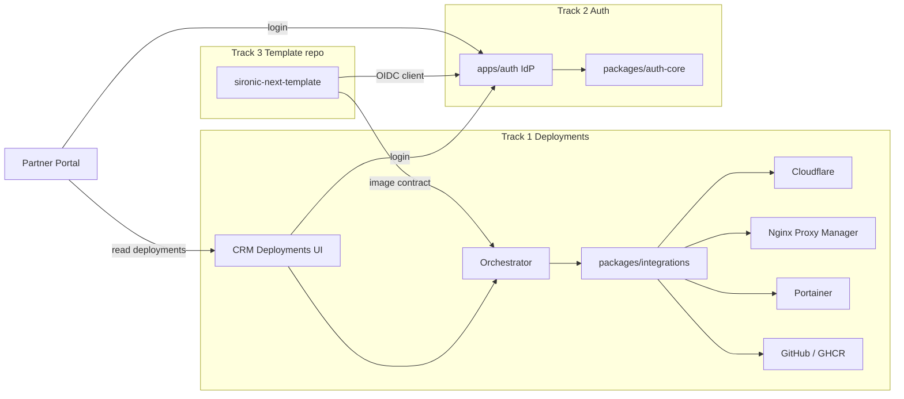

# 00 — Program Overview

## 1. Vision

Today, provisioning a partner site means juggling Cloudflare, Nginx Proxy Manager (NPM), Portainer, and GitHub Actions in separate browser tabs. Partners cannot see what was deployed for them, and fees are tracked outside the ERP.

This program moves that flow into SIRONIC IntraSystem:

1. **CRM staff** create, adopt, change, and redeploy partner sites from one module, with every step optional/skippable/adoptable.
2. **Partners** see their deployments on the portal, manage which employees can access which deployments, and see billing status.
3. **Deployed Next.js sites** (from a reusable template repo) authenticate users against a **central auth platform** (same credentials as CRM/portal), while keeping their own local user tables linked to platform identities — the same pattern as Google OAuth account linking.
4. **Fees** come from configurable packages (CPU/RAM/disk/price/cycle) assigned per deployment, with payment follow-up.

Observability (metrics/logs) is **deferred**; only an ingest/query seam is locked now.

---

## 2. Three tracks

| Track               | Delivers                                                           | Depends on                                          |
| ------------------- | ------------------------------------------------------------------ | --------------------------------------------------- |
| **1 Deployments**   | Models, integrations, orchestrator, CRM/portal UI, billing, import | Existing CRM patterns; secrets crypto               |
| **2 Auth platform** | Central IdP + migration off duplicated NextAuth                    | Track 1 can start without it; template/SSO needs it |
| **3 Next template** | Separate repo; deploy contract for Track 1                         | Track 2 for SSO; Track 1 for provision              |

---

## 3. Phase roadmap

| Phase  | Focus                                                                     | Exit criteria                                                                                 |
| ------ | ------------------------------------------------------------------------- | --------------------------------------------------------------------------------------------- |
| **P0** | Docs (this tree) + decisions locked                                       | Specs reviewable; no code yet                                                                 |
| **P1** | Integrations package + IntegrationConnection vault + dry-run orchestrator | Can call CF/NPM/Portainer/GH from CRM settings with test buttons; steps plan without mutating |
| **P2** | Deployment CRUD + full orchestrator execute/adopt/skip/verify             | One greenfield domain end-to-end; one adopt of existing stack                                 |
| **P3** | Portal views + PartnerDeploymentAccess + partner team invites             | Partner admin sees deployments; can invite employee and scope access                          |
| **P4** | Billing packages + payments + overdue board                               | Package assigned; periods roll; last-paid tracked                                             |
| **P5** | Import/reconcile existing infra                                           | Scan → correlate by domain → bulk adopt                                                       |
| **P6** | Central auth platform + CRM/portal migration                              | Single login for staff/partners; OIDC live                                                    |
| **P7** | Template repo + first provisioned partner site via SSO                    | Template image on GHCR; orchestrator deploys it; partner logs in with platform creds          |
| **P8** | Observability (future)                                                    | See [`deferred/observability.md`](./deferred/observability.md)                                |

Phases P1–P5 are Track 1. P6 is Track 2. P7 is Track 3. P8 is deferred.

---

## 4. Glossary

| Term                                 | Meaning                                                                                                                          |
| ------------------------------------ | -------------------------------------------------------------------------------------------------------------------------------- |
| **Partner / Contact / Organization** | Same MongoDB `Contact` document. No separate Partner collection.                                                                 |
| **Deployment**                       | First-class record of a hosted site: domain, DNS, SSL, proxy host, Portainer stack, image, billing package, linked `contact_id`. |
| **Step**                             | One unit of the provision pipeline (e.g. `dns_records`, `stack_create`). Independent status.                                     |
| **Adopt**                            | Attach an already-existing external resource (zone ID, proxy host ID, stack ID) to a step without recreating it.                 |
| **Skip**                             | Mark a step intentionally unused for this deployment.                                                                            |
| **Stack template**                   | Base Docker Compose with placeholders + required `nginxproxy_default` external network.                                          |
| **Deployment package**               | Billable SKU: resource params + price + cycle (monthly / quarterly / yearly).                                                    |
| **Integration connection**           | Encrypted credentials + base URL for one provider (Cloudflare, NPM, Portainer, GitHub).                                          |
| **PartnerDeploymentAccess**          | Which portal users of a contact may see which deployments.                                                                       |
| **Platform identity**                | User in the central auth service (`apps/auth`).                                                                                  |
| **Account link**                     | Local user row in a deployment (or CRM/portal) pointing at a platform identity — Google-OAuth-shaped.                            |
| **NPM**                              | Nginx Proxy Manager (`jc21/nginx-proxy-manager`).                                                                                |
| **GHCR**                             | GitHub Container Registry (`ghcr.io`).                                                                                           |

---

## 5. Decisions log

| ID  | Decision                     | Choice                                                                     | Rationale / notes                                                                  |
| --- | ---------------------------- | -------------------------------------------------------------------------- | ---------------------------------------------------------------------------------- |
| D1  | Reverse proxy                | **Nginx Proxy Manager** REST API                                           | Stack already on host; compose joins `nginxproxy_default`; admin `:81`             |
| D2  | Auth for deployed sites      | **Central IdP + local user tables with account linking**                   | Same pattern as Google OAuth; partners use platform credentials                    |
| D3  | Passkeys                     | **WebAuthn passkeys** (plus TOTP 2FA, lockout)                             | User clarification: “keylocks” meant passkeys                                      |
| D4  | Billing                      | **Configurable packages** assigned per deployment; track cycle + last paid | Usage-based verification later when metrics exist                                  |
| D5  | Observability                | **Deferred**; seam only                                                    | Avoid premature infra                                                              |
| D6  | Doc language in `docs/`      | English prose                                                              | Match README/rules; Hungarian in SYSTEM_MANUAL / DATABASE                          |
| D7  | Cloudflare zone registration | **Manual NS at registrar** + automated `activation_check`                  | Public CF API cannot register a brand-new domain                                   |
| D8  | Portainer mode               | **Standalone** (`/api/stacks/create/standalone/string`)                    | Confirmed; Swarm documented only as non-goal                                       |
| D9  | Next template location       | **Separate repository** (not this monorepo)                                | Spec lives in `docs/next-template/`; code later                                    |
| D10 | Credential storage           | Reuse **AES-256-GCM** (`SECRETS_ENCRYPTION_KEY`), promote to `@crm/lib`    | Same as Secrets module                                                             |
| D11 | NPM Cloudflare token         | **Separate zone-scoped token** handed to NPM; keep our copy                | NPM stores DNS creds plaintext and never returns them; CVE-2024-39935 version gate |
| D12 | DomainHostingRecord          | **Absorb into Deployment**; migrate existing rows                          | Avoid parallel models                                                              |

---

## 6. Non-goals (this program)

- Replacing Portainer or NPM UIs for ad-hoc ops (CRM covers the partner-site happy path).
- Multi-region / multi-host Portainer clusters (single endpoint assumed).
- Kubernetes.
- Automatic registrar purchases (only CF zone + DNS after NS are pointed).
- Full Grafana/Prometheus stack (P8).
- Building the template app inside this monorepo (D9).

---

## 7. Success metrics (post-implementation)

- Greenfield partner domain: zone → DNS → SSL → proxy → stack → live HTTPS in **one CRM session** without opening provider UIs.
- Existing stack imported and linked to a Contact in **&lt; 15 minutes**.
- Partner admin sees deployments and invites a colleague with scoped access without CRM staff.
- Monthly package fee visible and last-paid tracked per deployment.
- Template site login with the same email/password (or passkey) as the partner portal.
