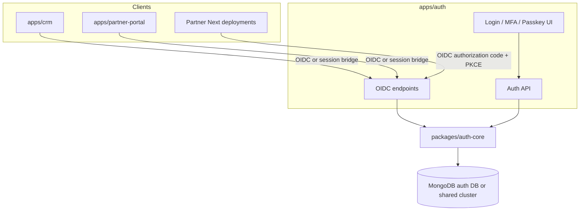
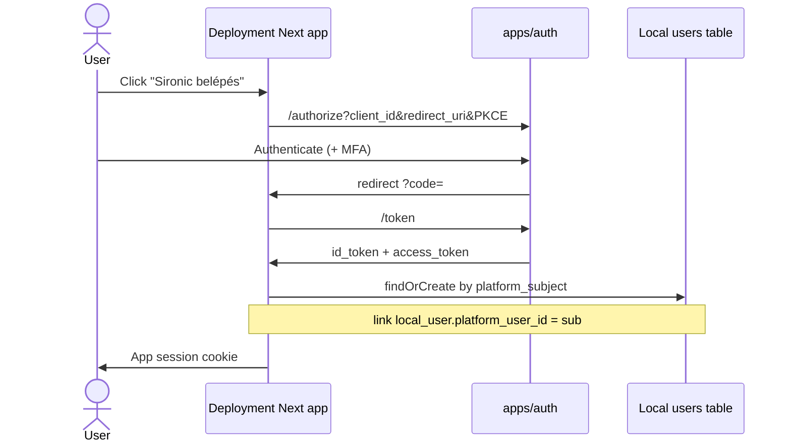

# Auth Platform — 01 Architecture

Central identity provider for CRM staff, partner portal users, and (later) admins on partner deployments. Replaces Google OAuth bootstrap and duplicated NextAuth credential logic.

**Package:** `packages/auth-core`  
**App:** `apps/auth` (Next.js or standalone Node — recommend Next.js App Router for consistency, or a thin Hono/Fastify service; **default: Next.js app** on its own host e.g. `https://auth.sironic.eu`)

---

## 1. Goals

| Capability                                       | Support                   |
| ------------------------------------------------ | ------------------------- |
| Email + password                                 | Yes                       |
| Magic link                                       | Yes (existing pattern)    |
| TOTP 2FA                                         | Yes                       |
| Recovery codes                                   | Yes                       |
| WebAuthn **passkeys**                            | Yes (decision D3)         |
| Password reset                                   | Yes                       |
| Account lockout / brute-force                    | Yes                       |
| OIDC provider for deployments                    | Yes                       |
| Account linking (local user ↔ platform identity) | Yes — Google-OAuth-shaped |

---

## 2. Component diagram

---

## 3. Flows

### 3.1 Password login

1. User submits email/password to auth UI or OIDC `/authorize` with prompt.
2. `auth-core` verifies bcrypt hash; checks lockout; if TOTP enabled → MFA challenge; if passkey preferred can offer.
3. Issues session cookie (auth app) and/or OIDC codes/tokens to client.

### 3.2 Magic link

1. `POST /api/magic-link` → store SHA-256 token hash + 15m TTL on identity.
2. Email link to `https://auth.../magic?token=`.
3. Consume once → session.

### 3.3 TOTP 2FA

1. Enrollment: generate secret, show QR, confirm code → store encrypted secret; issue recovery codes (hashed).
2. Login: after password, require 6-digit TOTP or recovery code.

### 3.4 WebAuthn passkeys

1. Enrollment: `navigator.credentials.create` with RP id = auth apex.
2. Store credential id + public key + transports on identity.
3. Login: `navigator.credentials.get` as primary or second factor.

### 3.5 Password reset

1. Request → token email → set password → invalidate sessions.

### 3.6 Lockout

- After N failed password attempts (e.g. 5 / 15 min): temporary lock.
- Admin unlock via CRM (service account) or time expiry.

### 3.7 OIDC login for a deployment (account link)

Same pattern as Google: local profile/roles stay in the deployment DB; identity proof comes from IdP.

---

## 4. Trust boundaries

- Auth app holds password hashes, TOTP secrets, WebAuthn public keys.
- CRM/portal eventually **stop** storing password hashes (migration) or become OIDC clients only.
- Deployments never see platform password hashes.
- Client secrets for OIDC apps stored encrypted (integration vault pattern).

---

## 5. Related docs

- Data model → [`02-data-model.md`](./02-data-model.md)
- OIDC + linking → [`03-oidc-and-linking.md`](./03-oidc-and-linking.md)
- Migration → [`04-migration.md`](./04-migration.md)
- Build plan → [`05-implementation-plan.md`](./05-implementation-plan.md)
