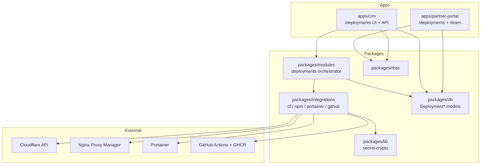
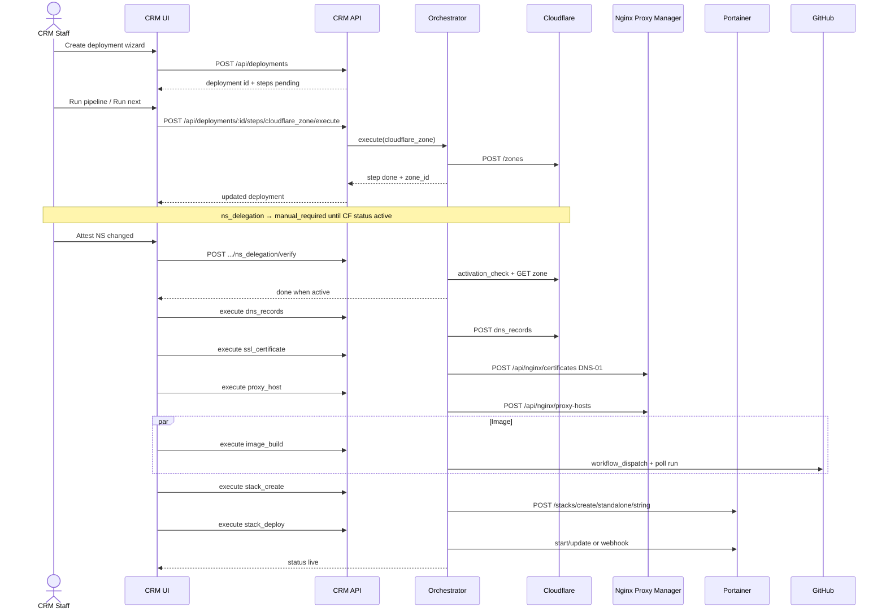
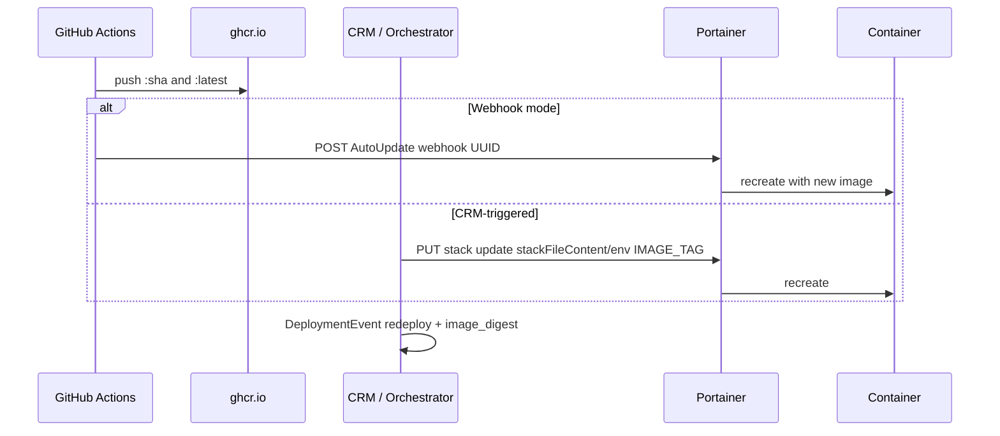

# 01 — Deployment Architecture

## 1. Component diagram



### Responsibilities

| Layer                                  | Owns                                                                                          |
| -------------------------------------- | --------------------------------------------------------------------------------------------- |
| **CRM UI**                             | Wizard, step runner, import, billing board, integration settings                              |
| **Portal UI**                          | Read-only / limited manage of own deployments; team + access matrix                           |
| **`packages/modules/.../deployments`** | Step registry, plan/execute/adopt/verify, status transitions, event emission                  |
| **`packages/integrations`**            | Typed HTTP clients, Zod response parsing, retries, secret redaction in logs                   |
| **`packages/db`**                      | Persistence only — no provider calls                                                          |
| **Providers**                          | Source of truth for live infra; Deployment record is CRM source of truth for intent + linkage |

---

## 2. Runtime topology (self-hosted)

```text
Internet
   │
   ▼
Cloudflare (DNS + optional proxy) ──► public IP / router
   │
   ▼
NPM :80/:443  (jc21/nginx-proxy-manager)
   │  proxy host → container:port on docker network nginxproxy_default
   ▼
Portainer-managed stacks (partner apps + sironic CRM/portal)
   │
   ▼
GHCR images built by GitHub Actions on main / workflow_dispatch
```

Assumptions locked by decisions:

- NPM data: `/home/next/dockerFolders/NPM/{data,cert}`
- External Docker network name: **`nginxproxy_default`**
- Portainer: **standalone** Docker (not Swarm)
- Single Portainer endpoint ID configured on `IntegrationConnection`

---

## 3. Pipeline (logical steps)

| #   | Step key          | Provider           | Creates / mutates                                      |
| --- | ----------------- | ------------------ | ------------------------------------------------------ |
| 1   | `cloudflare_zone` | Cloudflare         | Zone for apex domain                                   |
| 2   | `ns_delegation`   | Manual + CF verify | Registrar NS → CF nameservers; `activation_check`      |
| 3   | `dns_records`     | Cloudflare         | CNAME/A (and optional www) → router public IP / target |
| 4   | `ssl_certificate` | NPM                | Let's Encrypt via Cloudflare DNS-01                    |
| 5   | `proxy_host`      | NPM                | Host → `forward_host:forward_port` + cert              |
| 6   | `image_build`     | GitHub             | Workflow run; image on GHCR                            |
| 7   | `stack_create`    | Portainer          | Stack from `StackTemplate` + env                       |
| 8   | `stack_deploy`    | Portainer          | Deploy / update / AutoUpdate webhook                   |

Steps 6 and 1–5 are partially parallelizable: image build can start while DNS/SSL run, but `stack_create` waits for a resolvable image tag **and** proxy network assumptions.

---

## 4. Sequence — full-motion provision



Every provider call is also written as a `DeploymentEvent` (request metadata redacted, response summary, duration, actor).

---

## 5. Sequence — partial / adopt

Used when DNS or stack already exists.

```mermaid
sequenceDiagram
  actor Staff as CRM Staff
  participant Orch as Orchestrator
  participant CF as Cloudflare

  Staff->>Orch: adopt cloudflare_zone { zone_id }
  Orch->>CF: GET /zones/:id
  Orch-->>Staff: step status=adopted, external_ids.zone_id set

  Staff->>Orch: skip ssl_certificate
  Note over Orch: step status=skipped; dependents may still run if verify passes

  Staff->>Orch: verify proxy_host
  Orch-->>Staff: drift report or ok
```

Adopt always **reads** the external resource first; refuses adopt if domain mismatch or resource missing.

---

## 6. Sequence — redeploy on new image



The stack template and GitHub workflow should prefer **immutable `:sha` tags** in production; `:latest` only for lab.

---

## 7. Package layout (target)

```text
packages/integrations/
  package.json                 # @crm/integrations
  src/
    index.ts
    errors.ts                  # IntegrationError, ProviderHttpError
    redact.ts
    http.ts                    # fetch wrapper, retry, timeout
    cloudflare/
      client.ts
      types.ts
      schemas.ts
    npm/
      client.ts
      types.ts
      schemas.ts
    portainer/
      client.ts
      types.ts
      schemas.ts
    github/
      client.ts
      types.ts
      schemas.ts

packages/modules/src/deployments/
  index.ts
  types.ts
  registry.ts
  run-step.ts
  steps/
    cloudflare-zone.ts
    ns-delegation.ts
    dns-records.ts
    ssl-certificate.ts
    proxy-host.ts
    image-build.ts
    stack-create.ts
    stack-deploy.ts
```

Apps stay thin: route handlers load `IntegrationConnection`, decrypt secrets via `@crm/lib`, construct clients, call orchestrator.

---

## 8. Failure boundaries

| Layer                       | On failure                                                                                                                                         |
| --------------------------- | -------------------------------------------------------------------------------------------------------------------------------------------------- |
| Provider HTTP 4xx           | Step → `failed`; no auto-retry (except 429 with backoff)                                                                                           |
| Provider HTTP 5xx / network | Retry with exponential backoff (see integrations doc); then `failed`                                                                               |
| Step `failed`               | Pipeline stops advancing dependents; other independent branches may continue if UI runs them                                                       |
| Partial success             | Deployment status `degraded` if any step failed and any done                                                                                       |
| Rollback                    | **No automatic destroy** of CF/NPM/Portainer resources on failure (too dangerous). Explicit “Teardown” actions are separate, admin-only, confirmed |

---

## 9. Related docs

- Data model → [`02-data-model.md`](./02-data-model.md)
- Provider APIs → [`03-integrations.md`](./03-integrations.md)
- Step contracts → [`04-orchestrator.md`](./04-orchestrator.md)
