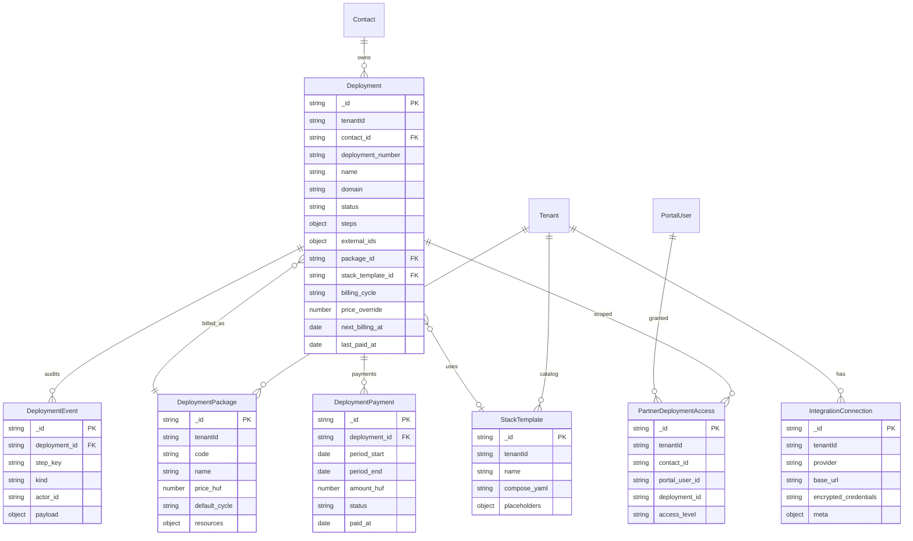

# 02 — Deployment Data Model

All models live in `@crm/db` (`packages/db`), follow existing `defineSchema` + `getModel` + `ts` timestamps (`created_at` / `updated_at`), and are multi-tenant via `tenantId`.

Partner linkage is always `contact_id` → `Contact._id` (string).

---

## 1. ERD



---

## 2. Shared enums / types (for `@crm/types`)

```ts
export type DeploymentStatus =
  "draft" | "provisioning" | "live" | "degraded" | "suspended" | "archived";

export type DeploymentStepKey =
  | "cloudflare_zone"
  | "ns_delegation"
  | "dns_records"
  | "ssl_certificate"
  | "proxy_host"
  | "image_build"
  | "stack_create"
  | "stack_deploy";

export type DeploymentStepStatus =
  "pending" | "running" | "done" | "failed" | "skipped" | "adopted" | "manual_required";

export type BillingCycle = "monthly" | "quarterly" | "yearly";

export type IntegrationProvider = "cloudflare" | "npm" | "portainer" | "github";

export type DeploymentPaymentStatus = "due" | "paid" | "overdue" | "waived" | "cancelled";

export type PartnerDeploymentAccessLevel = "view" | "manage";
```

---

## 3. `Deployment`

**Collection:** `deployments`  
**File:** `packages/db/src/models/deployment.ts`

```ts
{
  tenantId: String,                    // required, indexed
  contact_id: String,                  // required, indexed — Contact._id
  deployment_number: String,           // required, unique per tenant — e.g. DEP-000042 via Counter
  name: String,                        // required — human label
  domain: String,                      // required, lowercase — apex or FQDN managed site
  www_redirect: Boolean,               // default true
  status: enum DeploymentStatus,       // default "draft"
  notes: String | null,

  // Desired config (intent)
  dns: {
    record_type: enum ["A", "CNAME"],  // default "A"
    target: String,                    // public IP or hostname
    proxied: Boolean,                  // Cloudflare orange-cloud; default false for CNAME-to-IP setups often false
  },
  proxy: {
    forward_host: String,              // docker DNS name or IP on npm network
    forward_port: Number,              // e.g. 3000
    forward_scheme: enum ["http", "https"], // default "http"
    websocket_support: Boolean,        // default true
  },
  image: {
    repository: String,                // ghcr.io/owner/name
    tag: String,                       // sha or semver
    workflow_id: String | null,        // GitHub workflow file or numeric id
    workflow_ref: String | null,       // branch, default "main"
  },
  stack: {
    stack_name: String,                // Portainer stack name
    template_id: String | null,        // StackTemplate._id
    env: [{ name: String, value: String }], // non-secret env; secrets via Secret model or vault refs
  },

  // Billing
  package_id: String | null,
  billing_cycle: enum BillingCycle | null,
  price_override_huf: Number | null,   // null → use package price
  next_billing_at: Date | null,
  last_paid_at: Date | null,
  billing_notes: String | null,

  // Embedded pipeline
  steps: [{
    key: enum DeploymentStepKey,       // required
    status: enum DeploymentStepStatus, // default "pending"
    external_id: String | null,        // primary provider id for this step
    message: String | null,            // last human-readable status
    last_error: String | null,
    started_at: Date | null,
    finished_at: Date | null,
    meta: Mixed,                       // step-specific JSON (safe to return to CRM)
  }],

  // Denormalized external ids for fast lookup / import correlation
  external_ids: {
    cloudflare_zone_id: String | null,
    cloudflare_dns_record_ids: [String],
    npm_certificate_id: Number | null,
    npm_proxy_host_id: Number | null,
    portainer_stack_id: Number | null,
    portainer_endpoint_id: Number | null,
    portainer_webhook_id: String | null,
    github_last_run_id: Number | null,
    image_digest: String | null,
  },

  // Import / migration
  source: enum ["created", "imported"], // default "created"
  migrated_from_domain_hosting_id: String | null,

  created_by: String,                  // CrmUser._id
  archived_at: Date | null,
  archive_reason: String | null,
  created_at, updated_at
}
```

**Indexes**

```text
{ tenantId: 1, deployment_number: 1 } unique
{ tenantId: 1, domain: 1 } unique
{ tenantId: 1, contact_id: 1, status: 1 }
{ tenantId: 1, "external_ids.cloudflare_zone_id": 1 }
{ tenantId: 1, "external_ids.portainer_stack_id": 1 }
{ tenantId: 1, next_billing_at: 1 }
```

**Default steps** — created on `POST` with all eight keys in order, status `pending` (except optional ones left pending until configured).

---

## 4. `DeploymentEvent`

**Collection:** `deployment_events`  
**Append-only.** No updates/deletes from app code.

```ts
{
  tenantId: String,
  deployment_id: String,               // indexed
  step_key: enum DeploymentStepKey | null, // null for deployment-level events
  kind: enum [
    "step_plan",
    "step_execute_start",
    "step_execute_ok",
    "step_execute_fail",
    "step_adopt",
    "step_skip",
    "step_verify",
    "redeploy",
    "billing",
    "import",
    "note"
  ],
  actor_id: String | null,             // CrmUser or system
  actor_type: enum ["crm_user", "portal_user", "system", "webhook"],
  message: String,
  // Redacted request/response summaries only — never raw tokens
  detail: Mixed,
  duration_ms: Number | null,
  created_at                   // no updated_at — use created_at only schema option
}
```

**Indexes:** `{ tenantId: 1, deployment_id: 1, created_at: -1 }`

TTL: optional later (e.g. 2 years); not required for MVP.

---

## 5. `DeploymentPackage`

**Collection:** `deployment_packages`

```ts
{
  tenantId: String,
  code: String,                        // e.g. "small-5gb"
  name: String,                        // "Small — 5 GB, 1 core"
  description: String | null,
  price_huf: Number,                   // required, >= 0
  default_cycle: enum BillingCycle,    // default "monthly"
  resources: {
    vcpu: Number | null,               // e.g. 1
    ram_mb: Number | null,             // e.g. 1024
    disk_gb: Number | null,            // e.g. 5
    bandwidth_gb: Number | null,       // optional soft limit
    custom: Mixed                      // free-form params for future if-rules
  },
  is_active: Boolean,                  // default true
  sort_order: Number,
  created_at, updated_at
}
```

**Indexes:** `{ tenantId: 1, code: 1 } unique`

---

## 6. `DeploymentPayment`

**Collection:** `deployment_payments`

```ts
{
  tenantId: String,
  deployment_id: String,
  contact_id: String,                  // denormalized for queries
  package_id: String | null,
  period_start: Date,
  period_end: Date,
  amount_huf: Number,
  currency: String,                    // default "HUF"
  cycle: enum BillingCycle,
  status: enum DeploymentPaymentStatus,
  paid_at: Date | null,
  invoice_id: String | null,           // optional link to Invoice._id
  notes: String | null,
  created_by: String | null,
  created_at, updated_at
}
```

**Indexes:**

```text
{ tenantId: 1, deployment_id: 1, period_start: 1 } unique
{ tenantId: 1, status: 1, period_end: 1 }
{ tenantId: 1, contact_id: 1, status: 1 }
```

---

## 7. `StackTemplate`

**Collection:** `stack_templates`

```ts
{
  tenantId: String,
  name: String,
  description: String | null,
  is_default: Boolean,
  // Compose with placeholders: {{STACK_NAME}}, {{IMAGE}}, {{IMAGE_TAG}}, {{HOST_PORT}}, ...
  compose_yaml: String,
  placeholders: [{
    key: String,                       // without braces
    label: String,
    required: Boolean,
    default_value: String | null,
    secret: Boolean                    // if true, value comes from vault / Secret, not stored in template defaults
  }],
  // Always document required external network
  required_networks: [String],         // default ["nginxproxy_default"]
  created_by: String,
  created_at, updated_at
}
```

**Example base compose (canonical seed)**

```yaml
services:
  app:
    container_name: {{STACK_NAME}}
    image: {{IMAGE}}:{{IMAGE_TAG}}
    restart: unless-stopped
    ports:
      - "{{HOST_PORT}}:3000"
    environment:
      - AUTH_URL=https://{{DOMAIN}}
      - NEXTAUTH_URL=https://{{DOMAIN}}
      - MONGODB_URI={{MONGODB_URI}}
      - AUTH_SECRET={{AUTH_SECRET}}
      - PLATFORM_AUTH_ISSUER={{PLATFORM_AUTH_ISSUER}}
    networks:
      - default
      - nginxproxy_default

networks:
  default:
    driver: bridge
  nginxproxy_default:
    external: true
```

---

## 8. `IntegrationConnection`

**Collection:** `integration_connections`

```ts
{
  tenantId: String,
  provider: enum IntegrationProvider,
  label: String,                       // "Production Cloudflare"
  base_url: String,                    // e.g. https://npm.example.com:81
  // AES-256-GCM blob — same format as Secret.encrypted_value (iv:authTag:ciphertext)
  encrypted_credentials: String,
  // Non-secret config
  meta: {
    // cloudflare: { account_id?: string }
    // npm: { min_version?: string }
    // portainer: { endpoint_id: number, mode: "standalone" }
    // github: { owner: string, default_repo?: string }
  },
  is_active: Boolean,
  last_healthcheck_at: Date | null,
  last_healthcheck_ok: Boolean | null,
  last_healthcheck_message: String | null,
  created_by: String,
  created_at, updated_at
}
```

**Indexes:** `{ tenantId: 1, provider: 1, label: 1 } unique`

**Credential plaintext shapes** (before encrypt):

```ts
// cloudflare
{ api_token: string }

// npm
{ email: string, password: string }  // used to POST /api/tokens; cache JWT in memory/redis, not DB

// portainer
{ api_key: string }

// github
{ token: string }  // PAT or GitHub App installation token
```

Additionally store a **separate** Cloudflare token intended only for NPM DNS-01 (zone DNS edit), referenced as:

```ts
meta.npm_dns_token_secret_id?: string  // Secret._id or second IntegrationConnection
```

See [`10-security.md`](./10-security.md).

---

## 9. `PartnerDeploymentAccess`

**Collection:** `partner_deployment_accesses`

```ts
{
  tenantId: String,
  contact_id: String,
  portal_user_id: String,
  deployment_id: String,
  access_level: enum ["view", "manage"], // manage = restart/redeploy if portal allowed later; MVP view+status
  created_by: String | null,             // portal admin or crm user
  created_at, updated_at
}
```

**Indexes:** `{ tenantId: 1, portal_user_id: 1, deployment_id: 1 } unique`  
`{ tenantId: 1, contact_id: 1, deployment_id: 1 }`

**Semantics**

- If a contact has **zero** access rows for a deployment, default for `partner.admin`: **view all** deployments of that contact (configurable tenant setting `deployments.default_admin_access: "all" | "explicit"`).
- Recommended default for MVP: `partner.admin` sees all contact deployments; `partner.viewer` sees only explicitly granted.
- Documented in [`07-rbac-and-partner-access.md`](./07-rbac-and-partner-access.md).

---

## 10. Portal permissions extension

Extend `PortalPermissions` / Contact embedded schema:

```ts
menu_deployments: boolean; // default false until enabled per partner
menu_team: boolean; // partner-side employee management
```

Update CRM org detail toggles and portal `filterNav()`.

---

## 11. RBAC type extensions (`packages/types`)

Add to `PermissionModule`:

```ts
| "deployment"
| "deployment_billing"
| "integration"
| "partner_team"
```

Add to `PermissionAction`:

```ts
| "provision"
| "adopt"
```

---

## 12. Absorbing `DomainHostingRecord`

Existing model: `packages/db/src/models/domain-hosting.ts` — passive `domain | hosting | ssl` rows per contact.

### Migration plan

1. Keep `DomainHostingRecord` readable during transition (no hard delete).
2. Script `scripts/migrate-domain-hosting-to-deployments.ts`:
   - For each record with `record_type: "domain"` and a parseable domain in `label` / `details`:
     - Create `Deployment` with `source: "imported"`, `status: "draft"`, steps mostly `pending` or `manual_required`.
     - Set `migrated_from_domain_hosting_id`.
     - Copy `expiry_date` into `meta` / notes.
   - Hosting/ssl sibling rows: attach notes on the same Deployment or create events.
3. CRM Domain/Hosting UI on organization detail: show banner “Migrated to Deployments” linking to `/deployments?contact_id=…`.
4. After staff confirm, stop writing new DomainHostingRecords; eventually archive collection.

Do **not** auto-call providers during migration — import/reconcile is a separate flow ([`09-import-reconciliation.md`](./09-import-reconciliation.md)).

---

## 13. Counter keys

| Counter name | Format                                                        |
| ------------ | ------------------------------------------------------------- |
| `deployment` | `DEP-XXXXXX` via existing `nextCounterValue` / `formatNumber` |

---

## 14. Serialization rules

- Never return `encrypted_credentials` or raw provider tokens.
- `DeploymentEvent.detail` must already be redacted at write time.
- Stack `env` values marked secret should be stored as refs (`secret:NAME`) not plaintext when possible; if plaintext present, redact in list endpoints (show `***` unless `reveal` permission).
