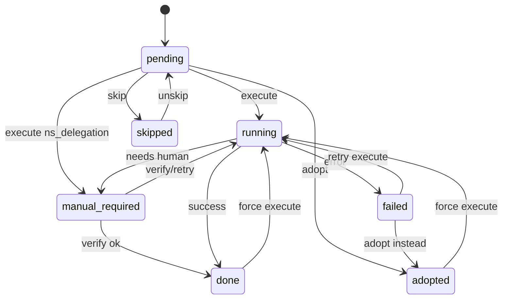
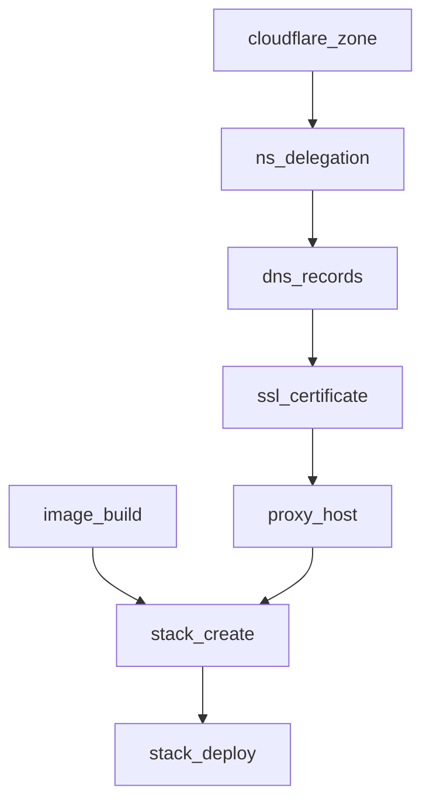

# 04 — Orchestrator

Location: `packages/modules/src/deployments/`.

The orchestrator is a **step-handler registry**. CRM API routes load a `Deployment`, resolve clients from `IntegrationConnection`, and call `runStep({ deployment, stepKey, action, input, actor })`.

---

## 1. Step handler contract

```ts
export interface StepContext {
  tenantId: string;
  deployment: Deployment; // lean or hydrated
  actor: ActorContext;
  clients: {
    cloudflare: CloudflareClient;
    npm: NpmClient;
    portainer: PortainerClient;
    github: GithubClient;
  };
  connections: Record<IntegrationProvider, IntegrationConnection>;
  now: Date;
}

export interface StepPlan {
  summary: string; // human, HU for UI
  mutations: Array<{ provider: string; action: string; target: string }>;
  warnings: string[];
}

export interface StepResult {
  status: DeploymentStepStatus; // done | failed | adopted | manual_required | skipped
  external_id?: string | null;
  message?: string;
  meta?: Record<string, unknown>;
  external_ids_patch?: Partial<Deployment["external_ids"]>;
  deployment_patch?: Partial<Deployment>; // rare: dns target etc.
}

export interface StepHandler {
  key: DeploymentStepKey;
  dependsOn: DeploymentStepKey[];
  canSkip: boolean;
  plan(ctx: StepContext, input?: unknown): Promise<StepPlan>;
  execute(ctx: StepContext, input?: unknown): Promise<StepResult>;
  adopt(
    ctx: StepContext,
    input: { external_id: string } & Record<string, unknown>,
  ): Promise<StepResult>;
  verify(ctx: StepContext): Promise<{ ok: boolean; drift: string[]; message: string }>;
}
```

`runStep` responsibilities:

1. Load fresh deployment (or use transactional update).
2. Enforce `dependsOn`: each dependency must be `done | adopted | skipped` (if skip allowed and verified).
3. Set step `status: running`, `started_at`, emit `step_execute_start`.
4. Call handler; on throw map `IntegrationError` → `failed`.
5. Patch step + `external_ids`; emit success/fail event; recompute deployment `status`.
6. Idempotent: if already `done|adopted` and `input.force !== true`, verify-only and return.

---

## 2. Deployment status derivation

```text
if any step failed AND (any done|adopted) → degraded
else if all required steps done|adopted|skipped → live
else if any running → provisioning
else if status was suspended → keep
else if archived → archived
else if any manual_required → provisioning
else → draft | provisioning based on whether any execute started
```

“Required” = steps where `canSkip === false` OR user did not skip.

---

## 3. Step status state machine



---

## 4. Dependency graph



| Step              | dependsOn                    | canSkip                                      |
| ----------------- | ---------------------------- | -------------------------------------------- |
| `cloudflare_zone` | —                            | yes (adopt or external DNS elsewhere — rare) |
| `ns_delegation`   | `cloudflare_zone`            | yes if zone already `active`                 |
| `dns_records`     | `ns_delegation`              | yes if records exist / adopt                 |
| `ssl_certificate` | `dns_records`                | yes if custom cert / adopt                   |
| `proxy_host`      | `ssl_certificate`            | yes with warning                             |
| `image_build`     | —                            | yes if image already on GHCR                 |
| `stack_create`    | `proxy_host`, `image_build`* | yes if adopt stack                           |
| `stack_deploy`    | `stack_create`               | no (unless whole stack skipped)              |

\* `image_build` dependency of `stack_create` is satisfied if step is `done|adopted|skipped` **and** `deployment.image.repository` + `tag` resolve (verify digest optional).

---

## 5. Step definitions

### 5.1 `cloudflare_zone`

- **plan:** “Create Cloudflare zone for `{domain}`” or “Zone already exists → suggest adopt”.
- **execute:** `createZone`; on “already exists”, fail with code `ZONE_EXISTS` and UI offers adopt.
- **adopt:** `getZone(external_id)`; domain must match; store `cloudflare_zone_id`, `meta.name_servers`.
- **verify:** zone exists; `name` matches `deployment.domain` apex.

### 5.2 `ns_delegation`

- **execute:** Always → `manual_required` with message listing CF `name_servers`. Does not change registrar.
- **adopt:** N/A (or mark done if zone already active).
- **verify:** `triggerActivationCheck` + `getZone`; success when `status === "active"`. Emit nameserver mismatch warnings if still pending.

### 5.3 `dns_records`

- **execute:** Upsert apex A/CNAME per `deployment.dns`; optionally www CNAME → apex.
- **adopt:** Accept record id(s); verify name/content.
- **verify:** Live records match intent (`content`, `proxied`).

### 5.4 `ssl_certificate`

- **execute:** NPM `createCertificate` DNS-01 with **NPM-scoped** CF token; store `npm_certificate_id`.
- **adopt:** Cert id; domain_names must include deployment domain.
- **verify:** Cert present; not expired (if API exposes dates).

### 5.5 `proxy_host`

- **execute:** Create proxy host with cert id, forward_host/port from `deployment.proxy`.
- **adopt:** Host id; domains must include deployment domain.
- **verify:** Forward target matches; certificate_id matches if set.

### 5.6 `image_build`

- **execute:** `dispatchWorkflow` + `waitForRun` (timeout e.g. 30m); set `github_last_run_id`; optionally resolve digest from GHCR.
- **adopt:** Provide `tag` + optional `digest` without running workflow.
- **verify:** Tag exists on GHCR (best-effort).

### 5.7 `stack_create`

- **execute:** Render `StackTemplate.compose_yaml` with placeholders → Portainer `createStackStandalone`; save stack id + webhook id.
- **adopt:** Stack id; optional pull file content into meta.
- **verify:** Stack exists; name matches; compose contains `nginxproxy_default`.

### 5.8 `stack_deploy`

- **execute:** `startStack` or `updateStack` with `pullImage: true`, or `triggerWebhook` if configured.
- **adopt:** Mark done if containers already running for stack.
- **verify:** At least one running container; optional HTTP health to `https://{domain}/api/health` when template supports it.

---

## 6. Skip / unskip / force

```ts
POST /api/deployments/:id/steps/:key/skip     // body: { reason?: string }
POST /api/deployments/:id/steps/:key/unskip
POST /api/deployments/:id/steps/:key/execute  // body: { force?: boolean, ...stepInput }
```

Skipping a step that others depend on: dependents may execute only if `verify` of skipped step returns `ok` **or** operator confirms `force_dependency_override` (crm.admin only).

---

## 7. Idempotency keys

For execute, compute:

```text
idempotency_key = sha256(deployment_id + step_key + canonical_intent_json)
```

Store last key in `steps[].meta.idempotency_key`. If same key and status done → no-op. If intent changed → allow re-execute (may update DNS/proxy rather than create). Prefer upsert APIs.

---

## 8. Drift detection

`verify` returns `drift: string[]` examples:

- `dns.content_mismatch: expected 1.2.3.4 got 5.6.7.8`
- `proxy.forward_port_mismatch`
- `stack.missing_external_network:nginxproxy_default`

CRM detail UI shows drift badges; `POST .../reconcile` can re-run execute for drifted steps (admin).

Scheduled reconcile (optional cron): see [`09-import-reconciliation.md`](./09-import-reconciliation.md).

---

## 9. Failure and rollback

| Policy               | Rule                                                                                   |
| -------------------- | -------------------------------------------------------------------------------------- |
| Auto-rollback        | **Never** delete CF zone, NPM host, or Portainer stack on step failure                 |
| Compensating actions | Explicit admin endpoints: teardown proxy host, stop stack, delete DNS — each confirmed |
| Partial pipeline     | Leave successful steps `done`; fix and retry failed step                               |
| Timeouts             | `running` stuck &gt; threshold → mark `failed` with `STUCK_TIMEOUT` via cron sweeper   |

---

## 10. Concurrency

- One **execute** per deployment at a time (Mongo update with `steps.key` status check / optimistic lock `updated_at`).
- Certificate creates globally mutex’d in NPM client.
- Image builds may run parallel across deployments.

---

## 11. Dry-run mode

`POST .../plan` or `execute` with `{ dry_run: true }` runs only `plan()` and writes `step_plan` events — no provider mutations. Used in P1 acceptance.
