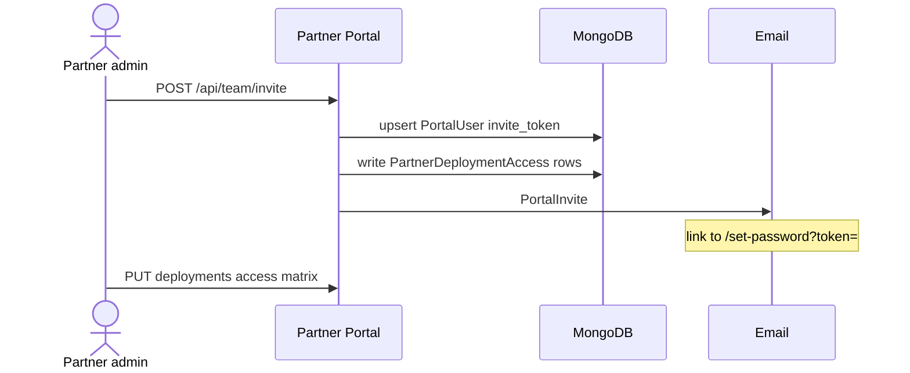

# 07 — RBAC and Partner Access

## 1. Type additions (`packages/types`)

```ts
export type PermissionModule =
  | /* existing */
  | "deployment"
  | "deployment_billing"
  | "integration"
  | "partner_team";

export type PermissionAction =
  | /* existing */
  | "provision"
  | "adopt";
```

`actionWeight`: give `provision` and `adopt` same weight as `write` (or between write and admin). `admin` still implies all.

---

## 2. Role grant matrix (`packages/rbac`)

### `crm.admin`

| Module               | Actions                                        |
| -------------------- | ---------------------------------------------- |
| `deployment`         | `admin`                                        |
| `deployment_billing` | `admin`                                        |
| `integration`        | `admin`                                        |
| `partner_team`       | `admin` (CRM can manage portal users as today) |

### `crm.staff`

| Module               | Actions                                               |
| -------------------- | ----------------------------------------------------- |
| `deployment`         | `view`, `write`, `provision`, `adopt`                 |
| `deployment_billing` | `view`, `write` (mark paid; no waive/delete packages) |
| `integration`        | `view` only (healthcheck OK; no credential write)     |
| `partner_team`       | `view`                                                |

Teardown + credential rotation + package delete + hard archive: **crm.admin** only.

### `partner.admin`

| Module               | Scope     | Actions                                                       |
| -------------------- | --------- | ------------------------------------------------------------- |
| `deployment`         | `contact` | `view` (+ redeploy if access_level manage — enforce in route) |
| `deployment_billing` | `contact` | `view` (amounts/status; no mark paid)                         |
| `partner_team`       | `contact` | `manage`                                                      |

### `partner.viewer`

| Module               | Scope     | Actions                                                  |
| -------------------- | --------- | -------------------------------------------------------- |
| `deployment`         | `contact` | `view` (only granted deployments)                        |
| `deployment_billing` | `contact` | `view` (optional; can hide via portal_permissions later) |

---

## 3. `PartnerDeploymentAccess` enforcement

```ts
async function assertPortalDeploymentAccess(opts: {
  tenantId: string;
  contactId: string;
  portalUserId: string;
  roleKeys: RoleKey[];
  deploymentId: string;
  need: "view" | "manage";
}): Promise<Deployment> {
  const dep = await DeploymentModel.findOne({
    _id: deploymentId,
    tenantId,
    contact_id: contactId,
    status: { $ne: "archived" },
  });
  if (!dep) throw new HttpError(404, "Not found");

  if (roleKeys.includes("partner.admin")) {
    // MVP default: all deployments for contact
    if (need === "manage") {
      const row = await PartnerDeploymentAccessModel.findOne({...});
      // admin may manage all unless tenant setting requires explicit manage grants
    }
    return dep;
  }

  const row = await PartnerDeploymentAccessModel.findOne({
    tenantId,
    portal_user_id: portalUserId,
    deployment_id: deploymentId,
  });
  if (!row) throw new HttpError(403, "Forbidden");
  if (need === "manage" && row.access_level !== "manage") {
    throw new HttpError(403, "Forbidden");
  }
  return dep;
}
```

**List filter for viewers:**

```ts
const accessIds = await PartnerDeploymentAccessModel.find({
  tenantId,
  portal_user_id,
  contact_id,
}).distinct("deployment_id");

filter._id = { $in: accessIds };
```

**Tenant setting** (Settings document extension, optional):

```ts
deployments: {
  partner_admin_sees_all: boolean; // default true
  partner_admin_manage_all: boolean; // default false — redeploy needs explicit manage
}
```

---

## 4. Partner team invite flow



Rules:

- Invitee email unique globally on `PortalUser` (existing constraint).
- Cannot invite outside own `contact_id`.
- `partner.viewer` cannot open `/team`.
- CRM org page remains able to invite (existing) and should sync access rows when deployments selected (enhancement).

---

## 5. Portal permissions flags

On `Contact.portal_permissions`:

| Flag               | Effect               |
| ------------------ | -------------------- |
| `menu_deployments` | Show Deployments nav |
| `menu_team`        | Show Csapat nav      |

CRM staff set these on organization detail. Defaults for new portal partners: both `false` until service sold.

---

## 6. Frontend checks

- CRM: `hasPermission(actor, { module: "deployment", action: "provision", scope: "global" })` to show Run buttons.
- Portal: hide Redeploy unless manage access; hide Team unless admin + menu_team.
- Never rely on UI alone — API enforces.
