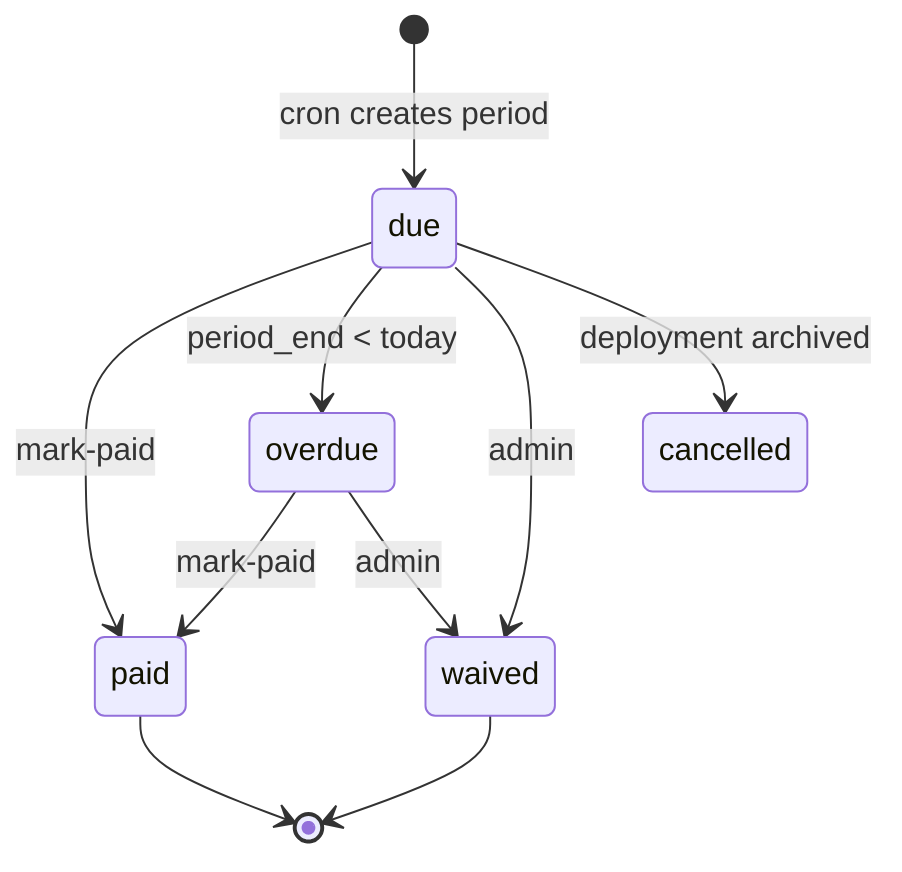

# 08 — Deployment Billing

## 1. Model recap

- **`DeploymentPackage`**: catalog SKU with `resources` (vcpu, ram_mb, disk_gb, …) + `price_huf` + `default_cycle`.
- **`Deployment`**: `package_id`, `billing_cycle`, `price_override_huf`, `next_billing_at`, `last_paid_at`.
- **`DeploymentPayment`**: one row per billing period per deployment.

Effective price:

```text
amount = deployment.price_override_huf ?? package.price_huf
cycle  = deployment.billing_cycle ?? package.default_cycle
```

---

## 2. Cycles

| Cycle       | Period length                                     | `next_billing_at` advance                    |
| ----------- | ------------------------------------------------- | -------------------------------------------- |
| `monthly`   | calendar month or 30-day — **choose anniversary** | +1 month (date-fns / luxor-style; clamp EOM) |
| `quarterly` | 3 months                                          | +3 months                                    |
| `yearly`    | 12 months                                         | +12 months                                   |

**MVP rule:** anniversary billing from `next_billing_at` initially set on first assign to `now` or start of next month (wizard choice). Document choice in UI: “Azonnal” vs “Következő hónap 1.”.

---

## 3. Period lifecycle



### Cron `GET /api/cron/deployment-billing`

Auth: `Bearer CRON_SECRET`.

Pseudo:

```
for each live|degraded deployment with package_id and next_billing_at <= now:
  ensure DeploymentPayment for [next_billing_at, period_end] status due
  advance next_billing_at by cycle

for each payment status due where period_end < startOfToday:
  set status overdue

emit DeploymentEvent kind=billing as needed
```

Idempotent via unique index `(tenantId, deployment_id, period_start)`.

---

## 4. Mark paid

`POST /api/deployment-payments/:id/mark-paid`:

- Sets `status: paid`, `paid_at`
- Sets `Deployment.last_paid_at = paid_at`
- Optional `invoice_id` link

**Invoice seam (optional MVP+):**

- Create draft `Invoice` for contact with line description `Deployment {name} ({domain}) {period}` and `total_amount = amount_huf`.
- Do **not** force Billingo sync in MVP; leave existing invoice module as-is.
- Future: map packages through `ServicePriceListItem` / pricing engine — out of scope until requested (decision D4 is package-first).

---

## 5. Parameter / if-rules (future-ready)

`DeploymentPackage.resources.custom` and package-level rules JSON (optional field later):

```ts
rules?: Array<{
  if: { metric: string; op: "gt" | "gte" | "lt"; value: number };
  then: { surcharge_huf?: number; flag?: string };
}>
```

Without observability metrics, rules are stored but **not evaluated**. When metrics arrive ([`../deferred/observability.md`](../deferred/observability.md)), cron can attach surcharges as extra payment lines or events.

Example package seed:

| code          | name                   | vcpu | disk_gb | price_huf | cycle   |
| ------------- | ---------------------- | ---- | ------- | --------- | ------- |
| `small-5gb`   | Small — 5 GB, 1 core   | 1    | 5       | 1000      | monthly |
| `medium-20gb` | Medium — 20 GB, 2 core | 2    | 20      | 3500      | monthly |

---

## 6. CRM UI behaviors

- Deployment billing tab: current package, edit cycle/override, payment history, “Fizetettnek jelöl”.
- Billing board: sort overdue first; color badges.
- Partner portal: show package name, amount, status, last paid — **read-only**.

---

## 7. Archival

On deployment archive:

- Cancel open `due`/`overdue` payments (`cancelled`) or leave overdue for collection — **default: leave overdue, cancel future due not started**.
- Stop cron from creating new periods (`status` not in `live|degraded`).

---

## 8. Acceptance checks

- Assign package → cron creates due row → mark paid → `last_paid_at` set.
- Override price used instead of package price.
- Quarterly advances `next_billing_at` by ~3 months.
- Portal cannot mark paid.
